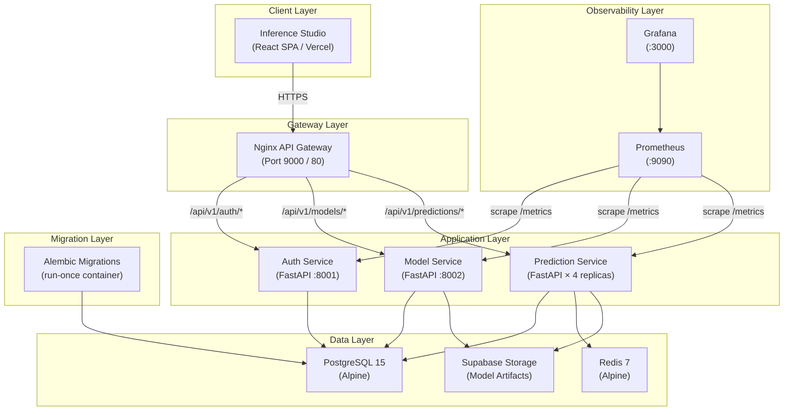
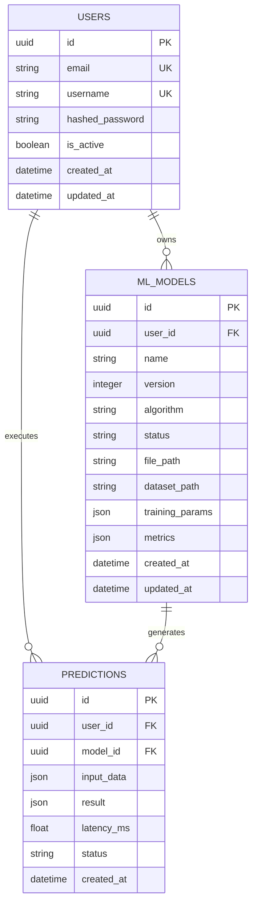

# Scalable ML Inference Platform

## Project Report

**Author:** Gaurav Srivastava  


---

## Table of Contents

1. [Executive Summary](#1-executive-summary)
2. [Project Objectives](#2-project-objectives)
3. [System Architecture Overview](#3-system-architecture-overview)
   - 3.1 [Architectural Philosophy](#31-architectural-philosophy)
   - 3.2 [High-Level System Topology](#32-high-level-system-topology)
   - 3.3 [Microservice Decomposition](#33-microservice-decomposition)
   - 3.4 [Shared Core Library](#34-shared-core-library)
4. [Technology Stack](#4-technology-stack)
5. [Detailed Workflow Analysis](#5-detailed-workflow-analysis)
   - 5.1 [User Authentication Workflow](#51-user-authentication-workflow)
   - 5.2 [Model Training Pipeline](#52-model-training-pipeline)
   - 5.3 [Single Inference Pipeline](#53-single-inference-pipeline)
   - 5.4 [Vectorized Batch Inference Pipeline](#54-vectorized-batch-inference-pipeline)
   - 5.5 [Live Telemetry Workflow](#55-live-telemetry-workflow)
6. [Data Architecture and Schema Design](#6-data-architecture-and-schema-design)
   - 6.1 [Entity-Relationship Model](#61-entity-relationship-model)
   - 6.2 [Database Schema](#62-database-schema)
   - 6.3 [Schema Migration Strategy](#63-schema-migration-strategy)
7. [Caching and Performance Optimisation Strategy](#7-caching-and-performance-optimisation-strategy)
   - 7.1 [Two-Tier Caching Architecture](#71-two-tier-caching-architecture)
   - 7.2 [Model Warm-Up Strategy](#72-model-warm-up-strategy)
   - 7.3 [Connection Pool Optimisation](#73-connection-pool-optimisation)
8. [Security Architecture](#8-security-architecture)
   - 8.1 [Authentication Mechanism](#81-authentication-mechanism)
   - 8.2 [Authorisation and Ownership Scoping](#82-authorisation-and-ownership-scoping)
   - 8.3 [Container Security](#83-container-security)
9. [Observability and Monitoring](#9-observability-and-monitoring)
   - 9.1 [Prometheus Metrics Instrumentation](#91-prometheus-metrics-instrumentation)
   - 9.2 [Grafana Dashboarding](#92-grafana-dashboarding)
   - 9.3 [Structured Logging](#93-structured-logging)
10. [Containerisation and Orchestration](#10-containerisation-and-orchestration)
    - 10.1 [Docker Image Strategy](#101-docker-image-strategy)
    - 10.2 [Docker Compose Orchestration](#102-docker-compose-orchestration)
    - 10.3 [Volume Architecture](#103-volume-architecture)
    - 10.4 [Horizontal Scaling](#104-horizontal-scaling)
11. [Cloud Deployment Architecture](#11-cloud-deployment-architecture)
    - 11.1 [Backend Deployment (Render)](#111-backend-deployment-render)
    - 11.2 [Frontend Deployment (Vercel)](#112-frontend-deployment-vercel)
    - 11.3 [Database (Neon PostgreSQL)](#113-database-neon-postgresql)
    - 11.4 [Object Storage (Supabase)](#114-object-storage-supabase)
    - 11.5 [API Gateway (Nginx)](#115-api-gateway-nginx)
12. [Frontend Architecture and Design Philosophy](#12-frontend-architecture-and-design-philosophy)
    - 12.1 [Application Structure](#121-application-structure)
    - 12.2 [User Experience Design](#122-user-experience-design)
    - 12.3 [State Management and Routing](#123-state-management-and-routing)
13. [Machine Learning Pipeline Design](#13-machine-learning-pipeline-design)
    - 13.1 [Algorithm Registry](#131-algorithm-registry)
    - 13.2 [Automatic Task Detection](#132-automatic-task-detection)
    - 13.3 [Feature Engineering Pipeline](#133-feature-engineering-pipeline)
    - 13.4 [Evaluation Metrics Framework](#134-evaluation-metrics-framework)
    - 13.5 [Model Artifact Serialisation](#135-model-artifact-serialisation)
14. [Load Testing and Performance Validation](#14-load-testing-and-performance-validation)
15. [Error Handling and Fault Tolerance](#15-error-handling-and-fault-tolerance)
16. [Challenges and Resolutions](#16-challenges-and-resolutions)
17. [Future Scope](#17-future-scope)
18. [Conclusion](#18-conclusion)
19. [Appendix A — Complete Project File Tree](#19-appendix-a--complete-project-file-tree)

---

## 1. Executive Summary

The **Scalable ML Inference Platform** is a full-stack, production-grade machine learning operations (MLOps) system engineered to deliver end-to-end machine learning model lifecycle management — from raw dataset ingestion and automated model training to real-time and batch inference at scale. The platform is architected around a **microservice-oriented design**, where each domain responsibility (authentication, model management, and prediction serving) operates as an independently deployable, containerised service communicating over a shared PostgreSQL database and a unified API gateway.

The system supports six major machine learning algorithms spanning both classification and regression tasks, employs a **two-tier caching architecture** (in-memory RAM cache and Redis) to achieve sub-millisecond inference latency for repeated queries, and is instrumented with a full **Prometheus-Grafana observability stack** for real-time monitoring of inference throughput, cache efficiency, and system health. The frontend, branded as **Inference Studio**, is a modern React-based single-page application deployed on Vercel, offering an interactive model registry, a feature sandbox for real-time inference experimentation, a live telemetry dashboard, and an immutable prediction history ledger.

The entire backend infrastructure is containerised using Docker, orchestrated via Docker Compose for local development, and deployed to the cloud using a multi-provider strategy: **Render** for backend services, **Neon** for managed PostgreSQL, **Supabase** for model artifact object storage, and **Vercel** for the frontend SPA.

---

## 2. Project Objectives

The primary objectives that guided the architectural and engineering decisions throughout this project are as follows:

1. **Microservice Architecture:** Decompose the platform into discrete, single-responsibility services — each owning its domain logic, independently deployable, and communicating through well-defined API contracts — to achieve separation of concerns and operational independence.

2. **Asynchronous-First Data Access:** Leverage fully asynchronous database operations using SQLAlchemy's async engine and the `asyncpg` driver to ensure that no I/O-bound operation blocks the event loop, enabling high concurrency under load.

3. **Containerised Infrastructure:** Encapsulate every service, database, cache, and monitoring component inside Docker containers, ensuring environment parity between development and production and enabling one-command reproducibility of the entire system.

4. **Intelligent Caching for Low-Latency Inference:** Implement a multi-tier caching strategy that combines in-process RAM caching (for model artifacts) and network-level Redis caching (for inference results) to dramatically reduce latency for repeat predictions and alleviate load on the ML pipeline.

5. **Production-Grade Security:** Enforce JWT-based stateless authentication with access and refresh token separation, bcrypt password hashing, ownership-scoped resource access, and non-root container execution across all services.

6. **Full Observability:** Instrument every service with Prometheus metrics (request counters, latency histograms, prediction probability distributions), structured logging, and a Grafana dashboarding layer to enable data-driven operational decision-making.

7. **Cloud-Native Deployment:** Architect the system for seamless deployment across multiple cloud providers, utilising managed databases, object storage, and serverless frontend hosting to achieve production availability.

8. **Rich Frontend Experience:** Build a premium, interactive frontend that visualises the ML lifecycle — model registration, training metrics, inference experimentation, telemetry monitoring, and historical audit — through a polished, dark-themed interface with motion design.

---

## 3. System Architecture Overview

### 3.1 Architectural Philosophy

The platform follows a **domain-driven microservice architecture** where each service encapsulates a bounded context:

- **Auth Service** owns user identity, credential management, and token issuance.
- **Model Service** owns dataset ingestion, model training orchestration, model versioning, and the model registry.
- **Prediction Service** owns real-time and batch inference execution, prediction logging, caching, and telemetry proxying.

All three services share a common **core library** (`ml_platform_core`) that provides ORM models, Pydantic schemas, security utilities, database connectivity, dependency injection providers, exception handling, and structured logging — ensuring consistency and eliminating code duplication across the service boundary.

> **Code Reference:** Each service's application factory follows the same pattern. The Auth Service factory in [auth-service/app/main.py](auth-service/app/main.py#L17-L43) instantiates a `FastAPI` application, registers the centralised exception handler, mounts the service-specific router with a versioned URL prefix, defines a `/health` endpoint, and instruments metrics — identically mirrored in [model-service/app/main.py](model-service/app/main.py#L17-L55) and [prediction-service/app/main.py](prediction-service/app/main.py#L80-L112).

```python
# auth-service/app/main.py — Application factory pattern (Lines 17–43)
def create_app() -> FastAPI:
    application = FastAPI(
        title="ML Platform — Auth Service",
        version="1.0.0",
        docs_url="/docs",
        redoc_url="/redoc",
    )
    application.add_exception_handler(MLPlatformError, ml_platform_exception_handler)
    application.include_router(auth_router, prefix="/api/v1/auth", tags=["auth"])

    @application.get("/health", tags=["health"])
    async def health_check():
        """Verify service and database connectivity."""
        try:
            async with async_session_factory() as session:
                await session.execute(text("SELECT 1"))
            return {"status": "healthy", "database": "connected"}
        except Exception as exc:
            logger.error(f"Health check failed: {exc}")
            from fastapi.responses import JSONResponse
            return JSONResponse(
                status_code=503,
                content={"status": "unhealthy", "database": "disconnected"},
            )
    Instrumentator().instrument(application).expose(application)
    return application

app = create_app()
```

### 3.2 High-Level System Topology

The system topology comprises the following containerised components in the local development environment:



### 3.3 Microservice Decomposition

| Service | Responsibility | Port (Host) | Internal Port | Key Dependencies |
|---|---|---|---|---|
| **Auth Service** | User registration, login, JWT issuance, token refresh, profile retrieval | 8001 | 8000 | PostgreSQL, `ml_platform_core` |
| **Model Service** | CSV dataset upload/validation, model training orchestration, model registry CRUD, artifact upload to Supabase | 8002 | 8000 | PostgreSQL, Supabase, scikit-learn, XGBoost, `ml_platform_core` |
| **Prediction Service** | Single and batch inference, two-tier caching, prediction ledger, Prometheus telemetry, live telemetry proxy | — (internal) | 8000 | PostgreSQL, Redis, Supabase, scikit-learn, `ml_platform_core` |
| **Nginx** | API gateway, CORS handling, path-based routing, SSL termination (cloud) | 9000 | 80 | Upstream services |
| **Migrations** | Alembic async schema migrations | — | — | PostgreSQL, `ml_platform_core` |
| **Prometheus** | Metrics scraping and time-series storage | 9090 | 9090 | All backend services |
| **Grafana** | Metrics visualisation and dashboarding | 3000 | 3000 | Prometheus |
| **Redis** | Tier 2 prediction result caching (TTL: 1 hour) | 6379 | 6379 | — |
| **PostgreSQL** | Primary relational data store | 5432 | 5432 | — |

> **Code Reference:** The complete service topology, port mappings, dependency chain, and replica configuration are defined in [docker-compose.yml](docker-compose.yml) (Lines 1–142).

### 3.4 Shared Core Library

The `ml_platform_core` package is a pip-installable Python library built with `setuptools` that serves as the single source of truth for cross-cutting concerns. It is installed into every backend service's Docker image at build time, providing:

- **ORM Models:** SQLAlchemy declarative models for `User`, `MLModel`, and `Prediction` with UUID primary keys, cascading foreign key relationships, and timezone-aware timestamps.
- **Pydantic Schemas:** Request/response validation schemas for authentication, model management, and prediction endpoints with strict field constraints.
- **Security Utilities:** JWT access/refresh token creation and verification using `python-jose`, bcrypt password hashing using `passlib`.
- **Database Infrastructure:** Async engine creation with connection pooling, session factory, and declarative base.
- **Dependency Providers:** FastAPI dependency injection functions for database session lifecycle management (auto-commit/rollback) and authenticated user resolution from JWT tokens.
- **Exception Hierarchy:** A structured exception class hierarchy with a centralised FastAPI exception handler.
- **Structured Logging:** A service-specific logging configuration with a unified format and noise suppression.

> **Code Reference — Package definition:** [ml_platform_core/pyproject.toml](ml_platform_core/pyproject.toml) (Lines 1–25) defines the installable package with its Python 3.11+ requirement and core dependencies.

```toml
# ml_platform_core/pyproject.toml — Package definition (Lines 1–25)
[build-system]
requires = ["setuptools>=65.0", "wheel"]
build-backend = "setuptools.build_meta"

[project]
name = "ml-platform-core"
version = "0.1.0"
description = "Shared core library for ML Inference Platform"
authors = [{name = "Gaurav Srivastava"}]
requires-python = ">=3.11"

dependencies = [
    "fastapi==0.109.2",
    "uvicorn[standard]==0.27.1",
    "sqlalchemy[asyncio]==2.0.27",
    "asyncpg==0.29.0",
    "pydantic==2.6.1",
    "pydantic-settings==2.1.0",
    "python-jose[cryptography]==3.3.0",
    "passlib[bcrypt]==1.7.4",
    "python-multipart==0.0.9",
]
```

> **Code Reference — Module exports:** The [ml_platform_core/\_\_init\_\_.py](ml_platform_core/ml_platform_core/__init__.py) file declares `__version__ = "0.1.0"`, and [models/\_\_init\_\_.py](ml_platform_core/ml_platform_core/models/__init__.py) (Lines 1–8) re-exports all ORM models so Alembic can auto-discover them:

```python
# ml_platform_core/models/__init__.py — ORM model registry (Lines 1–8)
"""SQLAlchemy ORM models — import all models here so Alembic can discover them."""
from ml_platform_core.database import Base
from ml_platform_core.models.user import User
from ml_platform_core.models.ml_model import MLModel
from ml_platform_core.models.prediction import Prediction

__all__ = ["Base", "User", "MLModel", "Prediction"]
```

---

## 4. Technology Stack

### Backend

| Component | Technology | Version | Purpose |
|---|---|---|---|
| Web Framework | FastAPI | 0.109.2 | Async REST API framework |
| ASGI Server | Uvicorn | 0.27.1 | Production-grade ASGI server |
| ORM | SQLAlchemy (async) | 2.0.27 | Asynchronous database access |
| DB Driver | asyncpg | 0.29.0 | High-performance async PostgreSQL driver |
| Validation | Pydantic | 2.6.1 | Request/response schema validation |
| Configuration | pydantic-settings | 2.1.0 | Environment-based configuration |
| Authentication | python-jose, passlib | 3.3.0, 1.7.4 | JWT tokens, bcrypt password hashing |
| ML Framework | scikit-learn | 1.4.0 | Machine learning pipelines |
| Gradient Boosting | XGBoost | ≥2.0.0 | Advanced gradient boosting models |
| Data Processing | pandas | 2.2.0 | Dataset manipulation |
| Model Serialisation | joblib | 1.3.2 | Model artifact persistence |
| Caching | Redis (via redis-py) | ≥5.0.1 | Distributed prediction caching |
| Metrics | prometheus-client, prometheus-fastapi-instrumentator | 0.19.0, 7.0.0 | Custom and HTTP metrics |
| HTTP Client | httpx | latest | Async Prometheus proxy |
| Object Storage Client | supabase-py | latest | Cloud model artifact storage |

> **Code Reference:** Service-specific dependency versions are locked in each service's `requirements.txt`:
> - [auth-service/requirements.txt](auth-service/requirements.txt) (12 lines)
> - [model-service/requirements.txt](model-service/requirements.txt) (17 lines — adds scikit-learn, pandas, joblib, xgboost, supabase)
> - [prediction-service/requirements.txt](prediction-service/requirements.txt) (20 lines — adds redis, httpx, prometheus-client, supabase)

### Frontend

| Component | Technology | Version | Purpose |
|---|---|---|---|
| Framework | React | 19.2.4 | UI component framework |
| Build Tool | Vite | 8.0.1 | Fast development and build tooling |
| Language | TypeScript | 5.9.3 | Static type safety |
| Styling | Tailwind CSS | 3.4.19 | Utility-first CSS framework |
| Animation | Framer Motion | 12.38.0 | Declarative animation system |
| Charts | Recharts | 3.8.1 | Data visualisation (bar, pie charts) |
| Routing | React Router DOM | 7.13.1 | Client-side routing |
| Icons | Lucide React | 0.577.0 | Icon library |
| Particles | react-tsparticles | 2.12.2 | Animated background effects |
| Notifications | Sonner | 2.0.7 | Toast notification system |

> **Code Reference:** All frontend dependency versions are declared in [inference-studio/package.json](inference-studio/package.json) (Lines 1–43).

### Infrastructure & Cloud Providers

| Component | Technology | Purpose |
|---|---|---|
| Containerisation | Docker | Service isolation and reproducibility |
| Orchestration | Docker Compose | Multi-container service orchestration |
| Database | PostgreSQL 15 (Alpine) | Primary relational data store |
| Cache | Redis 7 (Alpine) | Distributed caching layer |
| API Gateway | Nginx (Alpine) | Reverse proxy and CORS handling |
| Monitoring | Prometheus | Time-series metrics collection |
| Dashboarding | Grafana | Metrics visualisation |
| Migrations | Alembic | Database schema evolution |
| Backend Hosting | Render | Containerised backend services |
| Frontend Hosting | Vercel | Static SPA deployment with CDN |
| Managed Database | Neon | Serverless PostgreSQL |
| Object Storage | Supabase | Model artifact binary storage |

---

## 5. Detailed Workflow Analysis

### 5.1 User Authentication Workflow

The authentication workflow implements a stateless JWT-based system with dual-token architecture.

**Registration Flow:**

1. The client submits a `POST /api/v1/auth/register` request containing email, username, and password fields.
2. The Auth Service validates the request payload against the `UserRegisterRequest` Pydantic schema, enforcing constraints such as minimum password length (8 characters) and email format validation.
3. The service checks for existing users with the same email or username via asynchronous SQLAlchemy queries, raising a `ConflictError` (HTTP 409) if duplicates are detected.
4. The password is hashed using the `bcrypt` algorithm through `passlib` before being persisted.
5. A new `User` ORM record is created with a UUID v4 primary key, flushed to the database, and the response is returned.

> **Code Reference — Route handler:** [auth-service/app/routers/auth.py](auth-service/app/routers/auth.py) (Lines 23–31) defines the registration endpoint:

```python
# auth-service/app/routers/auth.py — Registration route (Lines 23–31)
@router.post(
    "/register",
    response_model=UserRegisterResponse,
    status_code=status.HTTP_201_CREATED,
)
async def register(body: UserRegisterRequest, db: AsyncSession = Depends(get_db)):
    """Register a new user account."""
    user = await AuthService.register(db, body)
    return user
```

> **Code Reference — Business logic:** [auth-service/app/services/auth_service.py](auth-service/app/services/auth_service.py) (Lines 33–56) implements the stateless `AuthService.register()` method with duplicate detection and bcrypt hashing:

```python
# auth-service/app/services/auth_service.py — Registration logic (Lines 33–56)
@staticmethod
async def register(db: AsyncSession, data: UserRegisterRequest) -> User:
    """Register a new user. Raises ConflictError if email/username taken."""
    # Check for existing email
    result = await db.execute(select(User).where(User.email == data.email))
    if result.scalar_one_or_none() is not None:
        raise ConflictError("Email already registered")

    # Check for existing username
    result = await db.execute(select(User).where(User.username == data.username))
    if result.scalar_one_or_none() is not None:
        raise ConflictError("Username already taken")

    user = User(
        email=data.email,
        username=data.username,
        hashed_password=get_password_hash(data.password),
    )
    db.add(user)
    await db.flush()
    await db.refresh(user)
    logger.info(f"User registered: {user.email} (id={user.id})")
    return user
```

> **Code Reference — Schema validation:** [ml_platform_core/schemas/auth.py](ml_platform_core/ml_platform_core/schemas/auth.py) (Lines 9–12) enforces input constraints:

```python
# ml_platform_core/schemas/auth.py — Registration schema (Lines 9–12)
class UserRegisterRequest(BaseModel):
    email: EmailStr
    username: str = Field(..., min_length=3, max_length=50)
    password: str = Field(..., min_length=8, max_length=128)
```

**Login Flow:**

1. The client submits a `POST /api/v1/auth/login` request with email and password.
2. The service retrieves the user record by email and verifies the plaintext password against the stored bcrypt hash.
3. If credentials are valid and the account is active, the service issues two JWT tokens:
   - **Access Token:** Short-lived (30 minutes), carries `sub` (user ID) and `type: "access"` claims.
   - **Refresh Token:** Long-lived (7 days), carries `sub` and `type: "refresh"` claims.
4. Both tokens are encoded using the HMAC-SHA256 algorithm with a server-side secret key.

> **Code Reference — Login logic:** [auth-service/app/services/auth_service.py](auth-service/app/services/auth_service.py) (Lines 58–80):

```python
# auth-service/app/services/auth_service.py — Login logic (Lines 58–80)
@staticmethod
async def login(db: AsyncSession, data: UserLoginRequest) -> TokenResponse:
    """Authenticate user and return JWT tokens."""
    result = await db.execute(select(User).where(User.email == data.email))
    user = result.scalar_one_or_none()

    if user is None or not verify_password(data.password, user.hashed_password):
        raise HTTPException(
            status_code=status.HTTP_401_UNAUTHORIZED,
            detail="Invalid email or password",
        )

    if not user.is_active:
        raise HTTPException(
            status_code=status.HTTP_403_FORBIDDEN,
            detail="Account is deactivated",
        )

    logger.info(f"User logged in: {user.email}")
    return TokenResponse(
        access_token=create_access_token(user.id),
        refresh_token=create_refresh_token(user.id),
    )
```

> **Code Reference — JWT creation:** [ml_platform_core/security.py](ml_platform_core/ml_platform_core/security.py) (Lines 24–51) implements token creation with configurable expiry:

```python
# ml_platform_core/security.py — Access token creation (Lines 24–36)
def create_access_token(user_id: UUID) -> str:
    """Create a short-lived JWT access token."""
    settings = get_settings()
    expire = datetime.now(timezone.utc) + timedelta(
        minutes=settings.jwt_access_token_expire_minutes
    )
    payload = {
        "sub": str(user_id),
        "type": "access",
        "exp": expire,
        "iat": datetime.now(timezone.utc),
    }
    return jwt.encode(payload, settings.jwt_secret_key, algorithm=settings.jwt_algorithm)
```

**Token Refresh and Request Authentication:**

> **Code Reference — Refresh:** [auth-service/app/services/auth_service.py](auth-service/app/services/auth_service.py) (Lines 82–108) validates the refresh token's `type` claim before issuing a new access token.

> **Code Reference — Request auth dependency:** [ml_platform_core/dependencies.py](ml_platform_core/ml_platform_core/dependencies.py) (Lines 29–61) implements `get_current_user()`:

```python
# ml_platform_core/dependencies.py — JWT authentication dependency (Lines 29–61)
async def get_current_user(
    token: str = Depends(oauth2_scheme),
    db: AsyncSession = Depends(get_db),
) -> User:
    """Decode JWT access token and return the authenticated User ORM object."""
    credentials_exception = HTTPException(
        status_code=status.HTTP_401_UNAUTHORIZED,
        detail="Could not validate credentials",
        headers={"WWW-Authenticate": "Bearer"},
    )

    payload = decode_token(token)
    if payload is None:
        raise credentials_exception

    user_id: str | None = payload.get("sub")
    token_type: str | None = payload.get("type")

    if user_id is None or token_type != "access":
        raise credentials_exception

    try:
        uid = uuid.UUID(user_id)
    except ValueError:
        raise credentials_exception

    result = await db.execute(select(User).where(User.id == uid))
    user = result.scalar_one_or_none()

    if user is None or not user.is_active:
        raise credentials_exception

    return user
```

> **Code Reference — Database session lifecycle:** [ml_platform_core/dependencies.py](ml_platform_core/ml_platform_core/dependencies.py) (Lines 18–26) manages auto-commit/rollback:

```python
# ml_platform_core/dependencies.py — DB session provider (Lines 18–26)
async def get_db() -> AsyncGenerator[AsyncSession, None]:
    """Yield an async DB session; commit on success, rollback on error."""
    async with async_session_factory() as session:
        try:
            yield session
            await session.commit()
        except Exception:
            await session.rollback()
            raise
```

### 5.2 Model Training Pipeline

The model training pipeline orchestrates the complete lifecycle from raw data ingestion to trained model artifact storage.

**Dataset Upload Phase:**

> **Code Reference — Route:** [model-service/app/routers/models.py](model-service/app/routers/models.py) (Lines 24–35)

> **Code Reference — Upload logic:** [model-service/app/services/model_service.py](model-service/app/services/model_service.py) (Lines 48–102) implements file validation, storage, and CSV struct verification:

```python
# model-service/app/services/model_service.py — Dataset upload (Lines 48–102)
@staticmethod
async def upload_dataset(file: UploadFile, user: User) -> DatasetUploadResponse:
    """Validate and persist a CSV dataset upload."""
    settings = get_settings()
    max_bytes = settings.max_dataset_size_mb * 1024 * 1024

    # Validate file extension
    if not file.filename or not file.filename.lower().endswith(".csv"):
        raise UnsupportedMediaTypeError("Only CSV files are accepted")

    # Read file content and validate size
    content = await file.read()
    if len(content) > max_bytes:
        raise FileTooLargeError(
            f"File exceeds maximum size of {settings.max_dataset_size_mb} MB"
        )
    if len(content) == 0:
        raise DataValidationError("Uploaded file is empty")

    # Generate dataset ID and save path
    dataset_id = str(uuid.uuid4())
    user_dir = os.path.join(STORAGE_BASE, "datasets", str(user.id))
    os.makedirs(user_dir, exist_ok=True)
    file_path = os.path.join(user_dir, f"{dataset_id}.csv")

    with open(file_path, "wb") as f:
        f.write(content)

    # Validate CSV structure
    try:
        df = pd.read_csv(file_path, nrows=5)
    except Exception:
        os.remove(file_path)
        raise DataValidationError("File is not a valid CSV")

    # Validate row count
    row_count = sum(1 for _ in open(file_path)) - 1  # subtract header
    if row_count > settings.max_dataset_rows:
        os.remove(file_path)
        raise DataValidationError(
            f"Dataset exceeds maximum of {settings.max_dataset_rows} rows"
        )
```

**Training Execution Phase:**

> **Code Reference — Training orchestration:** [model-service/app/services/model_service.py](model-service/app/services/model_service.py) (Lines 107–216) handles version auto-increment, DB record creation, training invocation, Supabase upload, and status transitions:

```python
# model-service/app/services/model_service.py — Training orchestration (Lines 128–207)
# Determine next version number
result = await db.execute(
    select(func.coalesce(func.max(MLModel.version), 0)).where(
        MLModel.user_id == user.id,
        MLModel.name == data.name,
    )
)
next_version = result.scalar() + 1

# ... (path preparation) ...

# Create DB record with "training" status
model = MLModel(
    user_id=user.id,
    name=data.name,
    version=next_version,
    algorithm=data.algorithm,
    status="training",
    file_path=relative_model_path,
    dataset_path=relative_dataset_path,
    training_params=data.training_params,
)
db.add(model)
await db.flush()

# Run training (synchronous in Phase 1)
try:
    metrics = train_model(
        dataset_path=dataset_path,
        target_column=data.target_column,
        algorithm=data.algorithm,
        model_save_path=model_file_path,
        training_params=data.training_params,
    )
    
    # Supabase upload
    url: str = os.environ.get("SUPABASE_URL")
    key: str = os.environ.get("SUPABASE_KEY")
    supabase = create_client(url, key)
    cloud_path = f"{user.id}/{data.name}/v{next_version}.joblib"
    
    with open(model_file_path, "rb") as f:
        supabase.storage.from_("models").upload(
            file=f,
            path=cloud_path,
            file_options={"content-type": "application/octet-stream"}
        )
    
    model.status = "ready"
    model.metrics = metrics
    model.file_path = cloud_path  # Save cloud path to DB
except Exception as exc:
    model.status = "failed"
    logger.error(f"Training failed for {model.name}: {exc}")
    await db.flush()
    raise TrainingError(f"Training failed: {str(exc)}")
```

> **Code Reference — Training engine:** [model-service/app/services/training.py](model-service/app/services/training.py) (Lines 75–211) contains the complete `train_model()` function. This is detailed further in **Section 13**.

### 5.3 Single Inference Pipeline

> **Code Reference:** The entire single inference flow is implemented in [prediction-service/app/services/prediction_service.py](prediction-service/app/services/prediction_service.py) `PredictionService.predict()` (Lines 102–269).

**Tier 2 Cache Check (Redis):**

```python
# prediction-service/app/services/prediction_service.py — Redis cache check (Lines 110–127)
request_dict = data.model_dump() if hasattr(data, "model_dump") else data.dict()
request_hash = hashlib.sha256(
    json.dumps(request_dict, sort_keys=True, default=str).encode()
).hexdigest()
cache_key = f"predict:{data.model_id}:{request_hash}"

if redis_cache.client:
    try:
        cached_result = await redis_cache.client.get(cache_key)
        if cached_result:
            logger.info("[TIER 2 HIT - REDIS] Bypassing ML Model")
            cached_data = json.loads(cached_result)
            INFERENCE_REQUESTS.labels(
                model_id=str(data.model_id), status="cache_hit", type="single"
            ).inc()
            return PredictionResponse(**cached_data)
    except Exception as e:
        logger.warning(f"Redis fetch failed, falling back to ML model: {e}")
```

**Tier 1 Cache Check and Supabase Download:**

```python
# prediction-service/app/services/prediction_service.py — Model loading (Lines 148–166)
if model.file_path in IN_MEMORY_MODEL_CACHE:
    logger.info("[TIER 1 HIT] Loading model instantly from RAM")
    model_artifact = IN_MEMORY_MODEL_CACHE[model.file_path]
else:
    logger.info("[TIER 1 MISS] Downloading model from Supabase...")
    url: str = os.environ.get("SUPABASE_URL")
    key: str = os.environ.get("SUPABASE_KEY")
    supabase = create_client(url, key)

    file_bytes = supabase.storage.from_("models").download(model.file_path)
    model_artifact = joblib.load(io.BytesIO(file_bytes))
    
    # Save it to RAM so we never have to download it again
    IN_MEMORY_MODEL_CACHE[model.file_path] = model_artifact
```

**Feature Encoding, Inference, and Probability Extraction:**

```python
# prediction-service/app/services/prediction_service.py — Inference core (Lines 168–199)
pipeline = model_artifact["pipeline"]
feature_columns: list[str] = model_artifact["feature_columns"]
label_encoders: dict = model_artifact.get("label_encoders", {})
target_encoder = model_artifact.get("target_encoder")

_validate_input_features(data.input_data, feature_columns)

df = pd.DataFrame([data.input_data])[feature_columns]

for col, le in label_encoders.items():
    if col in df.columns:
        df[col] = le.transform(df[col].astype(str))

raw_prediction = pipeline.predict(df)
pred_value: Any = raw_prediction[0]

# Probability extraction
probabilities = None
try:
    proba = pipeline.predict_proba(df)
    probabilities = proba[0].tolist()
except Exception:
    probabilities = None

# Target decoding
if target_encoder is not None:
    pred_value = target_encoder.inverse_transform([int(pred_value)])[0]
```

**Prometheus Instrumentation and Ledger Persistence:**

```python
# prediction-service/app/services/prediction_service.py — Metrics & storage (Lines 225–267)
latency_ms = round((time.perf_counter() - start_time) * 1000, 2)

INFERENCE_LATENCY.labels(model_id=str(data.model_id), type="single").observe(latency_ms / 1000.0)
INFERENCE_REQUESTS.labels(model_id=str(data.model_id), status="completed", type="single").inc()

if probabilities:
    for idx, prob in enumerate(probabilities):
        MODEL_PROBABILITIES.labels(model_id=str(data.model_id), class_index=str(idx)).observe(prob)

prediction_record = Prediction(
    user_id=user.id,
    model_id=data.model_id,
    input_data=data.input_data,
    result=pred_value,
    latency_ms=latency_ms,
    status="completed",
)

db.add(prediction_record)
await db.flush()
await db.refresh(prediction_record)

# Tier 2 Cache Store (Redis)
if redis_cache.client:
    try:
        response_json = response.model_dump_json()
        await redis_cache.client.setex(cache_key, 3600, response_json)
        logger.info("[TIER 2 STORE - REDIS] Saved prediction for 1 hour")
    except Exception as e:
        logger.warning(f"Redis save failed: {e}")
```

### 5.4 Vectorized Batch Inference Pipeline

> **Code Reference:** [prediction-service/app/services/prediction_service.py](prediction-service/app/services/prediction_service.py) `PredictionService.batch_predict()` (Lines 295–492).

The key differentiators from single inference are:

**Per-Row Validation with Error Isolation:**

```python
# prediction-service/app/services/prediction_service.py — Batch validation (Lines 374–387)
valid_rows = []
valid_indices = []

for idx, row in enumerate(request.input_data):
    try:
        _validate_input_features(row, feature_columns)
        valid_rows.append(row)
        valid_indices.append(idx)
    except Exception as exc:
        predictions[idx] = BatchPredictionItem(
            result=None,
            probabilities=None,
            error=str(exc),
        )
```

**Vectorised DataFrame Execution:**

```python
# prediction-service/app/services/prediction_service.py — Vectorized inference (Lines 392–428)
if valid_rows:
    df = pd.DataFrame(valid_rows)[feature_columns]

    for col, le in label_encoders.items():
        if col in df.columns:
            df[col] = le.transform(df[col].astype(str))

    try:
        raw_predictions = pipeline.predict(df)
        probabilities = None
        try:
            probabilities = pipeline.predict_proba(df)
        except Exception:
            probabilities = None

        for i, idx in enumerate(valid_indices):
            pred_value: Any = raw_predictions[i]
            if hasattr(pred_value, "item"):
                pred_value = pred_value.item()
            if target_encoder is not None:
                pred_value = target_encoder.inverse_transform([int(pred_value)])[0]

            proba = None
            if probabilities is not None:
                proba = probabilities[i].tolist()

            predictions[idx] = BatchPredictionItem(
                result=pred_value,
                probabilities=proba,
                error=None,
            )
            successful += 1
```

**Background Ledger Persistence:**

```python
# prediction-service/app/services/prediction_service.py — Background write (Lines 70–100)
@staticmethod
async def _save_batch_to_ledger_background(
    model_id: UUID, user_id: UUID, inputs: list[dict], 
    predictions: list[BatchPredictionItem], latency_ms: float
):
    """Silently saves successful predictions to PostgreSQL in the background."""
    try:
        async with async_session_factory() as session:
            prediction_records = []
            for idx, item in enumerate(predictions):
                if item.error is None:
                    record = Prediction(
                        user_id=user_id, model_id=model_id,
                        input_data=inputs[idx], result=item.result,
                        latency_ms=latency_ms, status="completed"
                    )
                    prediction_records.append(record)

            if prediction_records:
                session.add_all(prediction_records)
                await session.commit()
    except Exception as e:
        logger.error(f"[LEDGER ERROR] Background Task Failed: {str(e)}", exc_info=True)
```

> **Code Reference — Background task invocation:** Lines 480–490 enqueue the background write via FastAPI's `BackgroundTasks`:

```python
# prediction-service/app/services/prediction_service.py — Enqueue background (Lines 480–490)
if background_tasks:
    background_tasks.add_task(
        PredictionService._save_batch_to_ledger_background,
        request.model_id, user.id, request.input_data, predictions, latency_ms
    )
```

> **Code Reference — Route handler injecting BackgroundTasks:** [prediction-service/app/routers/predictions.py](prediction-service/app/routers/predictions.py) (Lines 76–88).

### 5.5 Live Telemetry Workflow

> **Code Reference:** [prediction-service/app/routers/predictions.py](prediction-service/app/routers/predictions.py) (Lines 28–73) implements the Prometheus proxy endpoint:

```python
# prediction-service/app/routers/predictions.py — Telemetry proxy (Lines 28–73)
@router.get("/telemetry/live")
async def get_live_telemetry():
    """Proxies requests to Prometheus and returns formatted metrics for the UI."""
    base_url = os.getenv("PROMETHEUS_URL", "http://prometheus:9090").rstrip("/")
    prometheus_url = f"{base_url}/api/v1/query"
    
    telemetry = {
        "cache_hit_rate": 0.0,
        "p95_latency_ms": 0.0,
        "total_predictions": 0,
        "current_rps": 0.0,
        "system_healthy": True
    }

    try:
        async with httpx.AsyncClient() as client:
            # Total Predictions
            res_total = await client.get(prometheus_url, 
                params={'query': 'sum(inference_requests_total)'})
            # P95 Latency (ms)
            res_lat = await client.get(prometheus_url, 
                params={'query': 'histogram_quantile(0.95, sum(rate(inference_latency_seconds_bucket[5m])) by (le)) * 1000'})
            # Current Traffic (RPS)
            res_rps = await client.get(prometheus_url, 
                params={'query': 'sum(rate(http_requests_total[1m]))'})
            # Cache Hit Rate
            res_cache = await client.get(prometheus_url, 
                params={'query': '(sum(inference_requests_total{status="cache_hit"}) / sum(inference_requests_total)) * 100'})
            # ... (response parsing) ...
    except Exception as e:
        logger.error(f"Prometheus proxy failed: {e}")
        telemetry["system_healthy"] = False

    return telemetry
```

> **Code Reference — Frontend consumer:** [inference-studio/src/Pulse.tsx](inference-studio/src/Pulse.tsx) (Lines 21–43) polls this endpoint every 2 seconds and feeds data into the traffic history bar chart.

---

## 6. Data Architecture and Schema Design

### 6.1 Entity-Relationship Model



### 6.2 Database Schema

> **Code Reference — User ORM:** [ml_platform_core/models/user.py](ml_platform_core/ml_platform_core/models/user.py) (Lines 17–47):

```python
# ml_platform_core/models/user.py — User ORM model (Lines 17–47)
class User(Base):
    __tablename__ = "users"

    id: Mapped[uuid.UUID] = mapped_column(
        PG_UUID(as_uuid=True), primary_key=True, default=uuid.uuid4
    )
    email: Mapped[str] = mapped_column(
        String(255), unique=True, nullable=False, index=True
    )
    username: Mapped[str] = mapped_column(
        String(100), unique=True, nullable=False, index=True
    )
    hashed_password: Mapped[str] = mapped_column(String(255), nullable=False)
    is_active: Mapped[bool] = mapped_column(Boolean, default=True, server_default="true")
    created_at: Mapped[datetime] = mapped_column(
        DateTime(timezone=True), server_default=func.now()
    )
    updated_at: Mapped[datetime] = mapped_column(
        DateTime(timezone=True), server_default=func.now(), onupdate=_utc_now
    )

    # Relationships
    models: Mapped[list["MLModel"]] = relationship(
        "MLModel", back_populates="owner", cascade="all, delete-orphan", lazy="selectin"
    )
    predictions: Mapped[list["Prediction"]] = relationship(
        "Prediction", back_populates="user", cascade="all, delete-orphan", lazy="selectin"
    )
```

> **Code Reference — MLModel ORM:** [ml_platform_core/models/ml_model.py](ml_platform_core/ml_platform_core/models/ml_model.py) (Lines 18–58) — note the composite unique constraint and JSON columns:

```python
# ml_platform_core/models/ml_model.py — MLModel ORM (Lines 18–58)
class MLModel(Base):
    __tablename__ = "ml_models"

    id: Mapped[uuid.UUID] = mapped_column(PG_UUID(as_uuid=True), primary_key=True, default=uuid.uuid4)
    user_id: Mapped[uuid.UUID] = mapped_column(
        PG_UUID(as_uuid=True), ForeignKey("users.id", ondelete="CASCADE"),
        nullable=False, index=True,
    )
    name: Mapped[str] = mapped_column(String(255), nullable=False)
    version: Mapped[int] = mapped_column(Integer, nullable=False)
    algorithm: Mapped[str] = mapped_column(String(100), nullable=False)
    status: Mapped[str] = mapped_column(String(50), nullable=False, server_default="pending")
    file_path: Mapped[str | None] = mapped_column(String(500), nullable=True)
    dataset_path: Mapped[str | None] = mapped_column(String(500), nullable=True)
    training_params: Mapped[dict[str, Any] | None] = mapped_column(JSON, nullable=True)
    metrics: Mapped[dict[str, Any] | None] = mapped_column(JSON, nullable=True)
    # ... timestamps, relationships ...

    __table_args__ = (
        UniqueConstraint("user_id", "name", "version", name="uq_user_model_version"),
    )
```

> **Code Reference — Prediction ORM:** [ml_platform_core/models/prediction.py](ml_platform_core/ml_platform_core/models/prediction.py) (Lines 14–47).

### 6.3 Schema Migration Strategy

> **Code Reference — Alembic environment:** [migrations/env.py](migrations/env.py) (Lines 1–67) uses async engine with NullPool:

```python
# migrations/env.py — Async migration runner (Lines 46–55)
async def run_async_migrations() -> None:
    """Run migrations using an async engine."""
    connectable = async_engine_from_config(
        config.get_section(config.config_ini_section, {}),
        prefix="sqlalchemy.",
        poolclass=pool.NullPool,
    )
    async with connectable.connect() as connection:
        await connection.run_sync(do_run_migrations)
    await connectable.dispose()
```

> **Code Reference — Initial schema migration:** [migrations/versions/001_initial_schema.py](migrations/versions/001_initial_schema.py) (Lines 1–88) creates all three tables with indexes and constraints using Alembic's `op.create_table()`:

```python
# migrations/versions/001_initial_schema.py — Table creation (Lines 21–32)
op.create_table(
    "users",
    sa.Column("id", postgresql.UUID(as_uuid=True), primary_key=True),
    sa.Column("email", sa.String(255), nullable=False),
    sa.Column("username", sa.String(100), nullable=False),
    sa.Column("hashed_password", sa.String(255), nullable=False),
    sa.Column("is_active", sa.Boolean(), server_default=sa.text("true"), nullable=False),
    sa.Column("created_at", sa.DateTime(timezone=True), server_default=sa.func.now()),
    sa.Column("updated_at", sa.DateTime(timezone=True), server_default=sa.func.now()),
    sa.UniqueConstraint("email", name="uq_users_email"),
    sa.UniqueConstraint("username", name="uq_users_username"),
)
```

---

## 7. Caching and Performance Optimisation Strategy

### 7.1 Two-Tier Caching Architecture

| Tier | Technology | Scope | Key Strategy | TTL | Purpose |
|---|---|---|---|---|---|
| **Tier 1** | In-Memory Python Dict | Per-process | Model file path → deserialized artifact | Permanent (process lifetime) | Eliminates Supabase download overhead |
| **Tier 2** | Redis 7 | Cross-process, cross-request | SHA-256 request hash → JSON response | 1 hour | Bypasses ML model execution for identical inputs |

> **Code Reference — Tier 1 RAM cache dictionary:** [prediction-service/app/services/prediction_service.py](prediction-service/app/services/prediction_service.py) (Lines 25–26):

```python
# prediction-service/app/services/prediction_service.py — RAM cache (Lines 25–26)
# --- TIER 1 RAM CACHE ---
IN_MEMORY_MODEL_CACHE: dict[str, Any] = {}
```

> **Code Reference — Redis client singleton:** [prediction-service/app/core/redis_client.py](prediction-service/app/core/redis_client.py) (Lines 1–25):

```python
# prediction-service/app/core/redis_client.py — Redis singleton (Lines 7–25)
class RedisPredictionCache:
    def __init__(self):
        self.client = None

    async def connect(self, url: str = None):
        """Initialize the Redis connection pool."""
        final_url = url or os.getenv("REDIS_URL", "redis://redis:6379/0")
        self.client = redis.from_url(final_url, decode_responses=True) 
        logger.info("Connected to Redis Prediction Cache (Tier 2).")

    async def close(self):
        """Close the connection pool cleanly."""
        if self.client:
            await self.client.aclose()

# Singleton instance
redis_cache = RedisPredictionCache()
```

### 7.2 Model Warm-Up Strategy

> **Code Reference — Warm-up routine:** [prediction-service/app/main.py](prediction-service/app/main.py) (Lines 24–66) implements `_warm_model_cache()`:

```python
# prediction-service/app/main.py — Model warm-up (Lines 24–66)
async def _warm_model_cache():
    """Warm-load recently used models into the in-memory cache."""
    logger.info("Starting model cache warm-up...")
    try:
        async with async_session_factory() as session:
            result = await session.execute(
                select(MLModel)
                .where(MLModel.status == "ready")
                .order_by(MLModel.updated_at.desc())
                .limit(model_cache.max_size)
            )
            models = result.scalars().all()
            for model in models:
                try:
                    model_path = os.path.join("/app/storage", model.file_path)
                    if not os.path.isfile(model_path):
                        continue
                    await model_cache.get_model(model_path)
                    logger.info(f"Warm-loaded model: {model.name} v{model.version}")
                except Exception as exc:
                    logger.error(f"Warm-load failed for model {model.name}: {exc}")
    except Exception as exc:
        logger.error(f"Model cache warm-up failed: {exc}")
```

> **Code Reference — Lifespan handler:** [prediction-service/app/main.py](prediction-service/app/main.py) (Lines 69–77) connects Redis and runs warm-up on startup:

```python
# prediction-service/app/main.py — Lifespan (Lines 69–77)
@asynccontextmanager
async def lifespan(application: FastAPI):
    """Modern lifespan handler — replaces deprecated on_event()."""
    # --- STARTUP ---
    await redis_cache.connect()
    await _warm_model_cache()
    yield
    # --- SHUTDOWN ---
    await redis_cache.close()
```

> **Code Reference — LRU Model Cache:** [prediction-service/app/core/model_cache.py](prediction-service/app/core/model_cache.py) (Lines 1–35) implements `OrderedDict`-based LRU eviction with `asyncio.Lock` and `asyncio.to_thread()`:

```python
# prediction-service/app/core/model_cache.py — LRU cache (Lines 6–35)
class ModelCache:
    def __init__(self, max_size: int = 5):
        self.cache = OrderedDict()
        self.max_size = max_size
        self.lock = asyncio.Lock()

    async def get_model(self, model_path: str):
        async with self.lock:
            if model_path in self.cache:
                self.cache.move_to_end(model_path)
                return self.cache[model_path]

            # Run blocking IO in thread pool
            model = await asyncio.to_thread(joblib.load, model_path)
            self.cache[model_path] = model

            if len(self.cache) > self.max_size:
                evicted = self.cache.popitem(last=False)
            return model
```

> **Code Reference — Cache singleton instantiation:** [prediction-service/app/core/cache_instance.py](prediction-service/app/core/cache_instance.py) (Lines 1–3):

```python
# prediction-service/app/core/cache_instance.py (Lines 1–3)
from app.core.model_cache import ModelCache
model_cache = ModelCache(max_size=5)
```

### 7.3 Connection Pool Optimisation

> **Code Reference:** [ml_platform_core/database.py](ml_platform_core/ml_platform_core/database.py) (Lines 14–30):

```python
# ml_platform_core/database.py — Async engine with expanded pool (Lines 14–30)
_settings = get_settings()

engine = create_async_engine(
    _settings.database_url,
    echo=False,
    pool_pre_ping=True,
    pool_size=10,        # Keep 10 connections open and ready
    max_overflow=20,     # Allow up to 20 extra burst connections
    pool_timeout=30,     # Wait up to 30s before failing
)

async_session_factory = async_sessionmaker(
    engine,
    class_=AsyncSession,
    expire_on_commit=False,
)
```

---

## 8. Security Architecture

### 8.1 Authentication Mechanism

> **Code Reference — Password hashing:** [ml_platform_core/security.py](ml_platform_core/ml_platform_core/security.py) (Lines 11–21):

```python
# ml_platform_core/security.py — Bcrypt context (Lines 11–21)
pwd_context = CryptContext(schemes=["bcrypt"], deprecated="auto")

def verify_password(plain_password: str, hashed_password: str) -> bool:
    """Verify a plain-text password against a bcrypt hash."""
    return pwd_context.verify(plain_password, hashed_password)

def get_password_hash(password: str) -> str:
    """Hash a plain-text password with bcrypt."""
    return pwd_context.hash(password)
```

> **Code Reference — Token decoding:** [ml_platform_core/security.py](ml_platform_core/ml_platform_core/security.py) (Lines 54–67):

```python
# ml_platform_core/security.py — Token verification (Lines 54–67)
def decode_token(token: str) -> dict | None:
    """Decode and validate a JWT token."""
    settings = get_settings()
    try:
        payload = jwt.decode(
            token, settings.jwt_secret_key, algorithms=[settings.jwt_algorithm]
        )
        return payload
    except JWTError:
        return None
```

### 8.2 Authorisation and Ownership Scoping

> **Code Reference — Model ownership check:** [model-service/app/routers/models.py](model-service/app/routers/models.py) (Lines 78–84):

```python
# model-service/app/routers/models.py — Ownership-scoped delete (Lines 78–84)
query = select(MLModel).where(
    MLModel.id == model_id, MLModel.user_id == current_user.id
)
result = await db.execute(query)
model = result.scalar_one_or_none()

if not model:
    raise HTTPException(status_code=404, detail="Model not found or access denied")
```

> **Code Reference — Prediction ownership scoping:** [prediction-service/app/services/prediction_service.py](prediction-service/app/services/prediction_service.py) (Lines 272–279):

```python
# prediction-service/app/services/prediction_service.py — List predictions (Lines 272–279)
@staticmethod
async def list_predictions(db: AsyncSession, user: User) -> list[Prediction]:
    """Fetch all predictions for the current logged-in user."""
    result = await db.execute(
        select(Prediction)
        .where(Prediction.user_id == user.id)
        .order_by(Prediction.created_at.desc())
    )
    return list(result.scalars().all())
```

### 8.3 Container Security

> **Code Reference — Non-root user pattern:** [auth-service/Dockerfile](auth-service/Dockerfile) (Lines 1–19):

```dockerfile
# auth-service/Dockerfile — Security hardening (Lines 1–19)
FROM python:3.11-slim
RUN pip install --upgrade pip setuptools wheel
RUN groupadd -r appuser && useradd -r -g appuser appuser

WORKDIR /app
COPY auth-service/requirements.txt .
RUN pip install --no-cache-dir -r requirements.txt
COPY ml_platform_core/ /app/ml_platform_core/
RUN pip install --no-cache-dir /app/ml_platform_core/
COPY auth-service/app/ /app/app/

RUN chown -R appuser:appuser /app
USER appuser

EXPOSE 8000
CMD ["uvicorn", "app.main:app", "--host", "0.0.0.0", "--port", "8000"]
```

> **Code Reference — Read-only volume mount:** [docker-compose.yml](docker-compose.yml) (Line 75):

```yaml
# docker-compose.yml — Prediction service read-only mount (Line 75)
prediction-service:
    volumes:
      - model-storage:/app/storage:ro   # <-- Read-only access
```

---

## 9. Observability and Monitoring

### 9.1 Prometheus Metrics Instrumentation

> **Code Reference — Custom metrics definitions:** [prediction-service/app/services/prediction_service.py](prediction-service/app/services/prediction_service.py) (Lines 28–45):

```python
# prediction-service/app/services/prediction_service.py — Prometheus metrics (Lines 28–45)
INFERENCE_REQUESTS = Counter(
    "inference_requests_total",
    "Total number of inference requests",
    ["model_id", "status", "type"]
)
INFERENCE_LATENCY = Histogram(
    "inference_latency_seconds",
    "Inference latency in seconds",
    ["model_id", "type"],
    buckets=[0.01, 0.05, 0.1, 0.25, 0.5, 1.0, 2.5, 5.0]
)
MODEL_PROBABILITIES = Histogram(
    "model_prediction_probability",
    "Model prediction probabilities (confidence)",
    ["model_id", "class_index"],
    buckets=[0.1, 0.2, 0.3, 0.4, 0.5, 0.6, 0.7, 0.8, 0.9, 1.0]
)
```

> **Code Reference — Auto-instrumentation:** All three services use `Instrumentator().instrument(application).expose(application)` at the end of their `create_app()` functions (e.g., [auth-service/app/main.py](auth-service/app/main.py) Line 42).

> **Code Reference — Prometheus scrape configuration:** [prometheus/prometheus.yml](prometheus/prometheus.yml) (Lines 1–16):

```yaml
# prometheus/prometheus.yml — Scrape configuration (Lines 1–16)
global:
  scrape_interval: 15s
  evaluation_interval: 15s

scrape_configs:
  - job_name: "ml-cloud-services"
    scheme: https
    static_configs:
      - targets: 
        - "ml-prediction-service-m7xo.onrender.com"
```

### 9.2 Grafana Dashboarding

> **Code Reference:** [docker-compose.yml](docker-compose.yml) (Lines 110–122):

```yaml
# docker-compose.yml — Grafana service (Lines 110–122)
grafana:
    image: grafana/grafana:latest
    container_name: grafana
    ports:
      - "3000:3000"
    environment:
      - GF_SECURITY_ADMIN_USER=admin
      - GF_SECURITY_ADMIN_PASSWORD=admin
    depends_on:
      - prometheus
    restart: unless-stopped
    volumes:
      - grafana-data:/var/lib/grafana
```

### 9.3 Structured Logging

> **Code Reference:** [ml_platform_core/logging.py](ml_platform_core/ml_platform_core/logging.py) (Lines 1–31):

```python
# ml_platform_core/logging.py — Structured logging setup (Lines 7–31)
def setup_logging(service_name: str, level: str = "INFO") -> logging.Logger:
    log_level = getattr(logging, level.upper(), logging.INFO)

    logging.basicConfig(
        level=log_level,
        format="%(asctime)s | %(name)s | %(levelname)s | %(message)s",
        datefmt="%Y-%m-%d %H:%M:%S",
        stream=sys.stdout,
        force=True,
    )

    # Reduce noise from third-party libraries
    logging.getLogger("uvicorn.access").setLevel(logging.WARNING)
    logging.getLogger("sqlalchemy.engine").setLevel(logging.WARNING)

    return logging.getLogger(service_name)
```

> **Code Reference — Configuration source:** [ml_platform_core/config.py](ml_platform_core/ml_platform_core/config.py) (Lines 8–37) defines the central `Settings` class using `pydantic-settings`:

```python
# ml_platform_core/config.py — Centralised settings (Lines 8–37)
class Settings(BaseSettings):
    """Central configuration for all ML Platform services."""
    database_url: str
    jwt_secret_key: str
    jwt_algorithm: str = "HS256"
    jwt_access_token_expire_minutes: int = 30
    jwt_refresh_token_expire_days: int = 7
    log_level: str = "INFO"
    max_dataset_size_mb: int = 100
    max_dataset_rows: int = 1_000_000

    model_config = SettingsConfigDict(
        env_file=".env", env_file_encoding="utf-8", extra="ignore",
    )

@lru_cache
def get_settings() -> Settings:
    """Return cached Settings instance."""
    return Settings()
```

---

## 10. Containerisation and Orchestration

### 10.1 Docker Image Strategy

All backend services share a common Dockerfile pattern. The Model Service Dockerfile adds storage directory creation, while the Prediction Service limits Uvicorn to a single worker:

> **Code Reference — Model Service Dockerfile:** [model-service/Dockerfile](model-service/Dockerfile) (Lines 1–22):

```dockerfile
# model-service/Dockerfile (Lines 1–22)
FROM python:3.11-slim
RUN pip install --upgrade pip setuptools wheel
RUN groupadd -r appuser && useradd -r -g appuser appuser
WORKDIR /app
COPY model-service/requirements.txt .
RUN pip install --no-cache-dir -r requirements.txt
COPY ml_platform_core/ /app/ml_platform_core/
RUN pip install --no-cache-dir /app/ml_platform_core/
COPY model-service/app/ /app/app/
RUN mkdir -p /app/storage/datasets /app/storage/models \
    && chown -R appuser:appuser /app
USER appuser
EXPOSE 8000
CMD ["uvicorn", "app.main:app", "--host", "0.0.0.0", "--port", "8000"]
```

> **Code Reference — Prediction Service Dockerfile:** [prediction-service/Dockerfile](prediction-service/Dockerfile) (Line 21) — single worker to avoid in-memory cache fragmentation:

```dockerfile
CMD ["uvicorn", "app.main:app", "--host", "0.0.0.0", "--port", "8000", "--workers", "1"]
```

> **Code Reference — Migrations Dockerfile:** [migrations/Dockerfile](migrations/Dockerfile) (Lines 1–21) runs `alembic upgrade head` as its entry point.

### 10.2 Docker Compose Orchestration

> **Code Reference:** [docker-compose.yml](docker-compose.yml) — Key dependency patterns:

```yaml
# docker-compose.yml — PostgreSQL health check (Lines 16–20)
healthcheck:
    test: [ "CMD-SHELL", "pg_isready -U ${POSTGRES_USER} -d ${POSTGRES_DB}" ]
    interval: 5s
    timeout: 5s
    retries: 10

# Migrations wait for healthy Postgres (Lines 30–32)
migrations:
    depends_on:
      postgres:
        condition: service_healthy

# Application services wait for migrations (Lines 44–46)
auth-service:
    depends_on:
      migrations:
        condition: service_completed_successfully
```

### 10.3 Volume Architecture

```yaml
# docker-compose.yml — Named volumes (Lines 138–141)
volumes:
  pgdata:
  model-storage:
  grafana-data:
```

### 10.4 Horizontal Scaling

> **Code Reference:** [docker-compose.yml](docker-compose.yml) (Lines 80–81):

```yaml
# docker-compose.yml — Prediction service scaling (Lines 80–81)
prediction-service:
    deploy:
      replicas: 4
```

---

## 11. Cloud Deployment Architecture

### 11.1–11.3 Backend, Frontend, and Database Deployment

> **Code Reference — Environment variables:** [.env.example](.env.example) (Lines 1–23) documents all required environment variables for local and cloud deployments.

### 11.4 Object Storage (Supabase)

> **Code Reference — Upload:** [model-service/app/services/model_service.py](model-service/app/services/model_service.py) (Lines 175–193) — Supabase upload after training.

> **Code Reference — Download:** [prediction-service/app/services/prediction_service.py](prediction-service/app/services/prediction_service.py) (Lines 155–165) — Supabase download with RAM caching.

### 11.5 API Gateway (Nginx)

> **Code Reference:** [nginx/nginx.conf](nginx/nginx.conf) (Lines 1–80):

```nginx
# nginx/nginx.conf — CORS and routing (Lines 1–80)
events {}
http {
    client_max_body_size 100M;
    
    server {
        listen 80;

        # Auth Service route
        location /api/v1/auth/ {
            if ($request_method = 'OPTIONS') {
                add_header 'Access-Control-Allow-Origin' '$http_origin' always;
                add_header 'Access-Control-Allow-Methods' 'GET, POST, PUT, DELETE, OPTIONS' always;
                add_header 'Access-Control-Allow-Headers' 'Authorization, Content-Type' always;
                add_header 'Access-Control-Allow-Credentials' 'true' always;
                add_header 'Access-Control-Max-Age' 86400;
                add_header 'Content-Length' 0;
                return 204;
            }
            add_header 'Access-Control-Allow-Origin' '$http_origin' always;
            add_header 'Access-Control-Allow-Credentials' 'true' always;
            proxy_pass https://ml-auth-service.onrender.com;
            proxy_ssl_server_name on;
            proxy_set_header Host ml-auth-service.onrender.com;
            proxy_set_header X-Real-IP $remote_addr;
        }

        # Prediction Service route — note proxy_hide_header to prevent CORS double-header
        location /api/v1/predictions/ {
            # ... OPTIONS handling ...
            proxy_hide_header Access-Control-Allow-Origin;
            add_header 'Access-Control-Allow-Origin' '$http_origin' always;
            add_header 'Access-Control-Allow-Credentials' 'true' always;
            proxy_pass https://ml-prediction-service-m7xo.onrender.com;
            proxy_ssl_server_name on;
            proxy_set_header Host ml-prediction-service-m7xo.onrender.com;
        }
    }
}
```

---

## 12. Frontend Architecture and Design Philosophy

### 12.1 Application Structure

| View | Route | Component | Description |
|---|---|---|---|
| **Auth** | `/` | `Auth.tsx` | Login and registration with animated split-pane layout |
| **Studio** | `/studio` | `Studio.tsx` | Model registry dashboard with grid view, search, and training pipeline modal |
| **Canvas** | `/model/:id` | `Canvas.tsx` | Per-model inference sandbox with feature sliders, bar charts, and donut/regression output |
| **Pulse** | `/pulse` | `Pulse.tsx` | Real-time telemetry dashboard with KPI cards and live traffic visualiser |
| **History** | `/history` | `History.tsx` | Immutable prediction ledger with lazy-loaded payload details |

> **Code Reference — Route definitions:** [inference-studio/src/App.tsx](inference-studio/src/App.tsx) (Lines 1–72):

```tsx
// inference-studio/src/App.tsx — Route configuration (Lines 22–56)
const AnimatedRoutes = () => {
    const location = useLocation();
    return (
        <AnimatePresence mode="wait">
            <Routes location={location} key={location.pathname}>
                <Route path="/" element={<PageTransition><Auth /></PageTransition>} />
                <Route path="/studio" element={
                    <ProtectedRoute><PageTransition><Studio /></PageTransition></ProtectedRoute>
                } />
                <Route path="/model/:id" element={
                    <ProtectedRoute><PageTransition><Canvas /></PageTransition></ProtectedRoute>
                } />
                <Route path="/pulse" element={
                    <ProtectedRoute><PageTransition><Pulse /></PageTransition></ProtectedRoute>
                } />
                <Route path="/history" element={
                    <ProtectedRoute><PageTransition><History /></PageTransition></ProtectedRoute>
                } />
            </Routes>
        </AnimatePresence>
    );
};
```

> **Code Reference — Protected route guard:** [inference-studio/src/App.tsx](inference-studio/src/App.tsx) (Lines 14–20):

```tsx
// inference-studio/src/App.tsx — Route protection (Lines 14–20)
const ProtectedRoute = ({ children }: { children: React.ReactNode }) => {
    const token = localStorage.getItem('access_token');
    if (!token) {
        return <Navigate to="/" replace />;
    }
    return <>{children}</>;
};
```

### 12.2 User Experience Design

> **Code Reference — Global particle background:** [inference-studio/src/GlobalBackground.tsx](inference-studio/src/GlobalBackground.tsx) (Lines 1–91) switches between an interactive "neural brain" mesh on the Auth page and a subtle ambient constellation on dashboard pages:

```tsx
// inference-studio/src/GlobalBackground.tsx — Dual-mode particles (Lines 15–78)
const options: ISourceOptions = useMemo(() => {
    if (isAuthPage) {
        // THE ORGANIC BRAIN (Auth Page)
        return {
            background: { color: "#050505" },
            particles: {
                color: { value: "#3b82f6" },
                links: { color: "#3b82f6", distance: 150, enable: true, opacity: 0.3 },
                move: { enable: true, speed: 0.8, outModes: "bounce" },
                number: { value: 60, density: { enable: true, area: 800 } },
            },
            interactivity: {
                events: { onHover: { enable: true, mode: "grab" } },
            },
        };
    } else {
        // THE AMBIENT CONSTELLATION (Studio Pages)
        return {
            background: { color: "#050505" },
            particles: {
                color: { value: "#ffffff" },
                links: { color: "#ffffff", distance: 250, enable: true, opacity: 0.03 },
                move: { enable: true, speed: 0.1, outModes: "out" },
                number: { value: 25 },
                opacity: { value: { min: 0.1, max: 0.3 }, animation: { enable: true, speed: 0.5 } },
            },
            interactivity: { events: { onHover: { enable: false } } },
        };
    }
}, [isAuthPage]);
```

> **Code Reference — Page transitions:** [inference-studio/src/PageTransition.tsx](inference-studio/src/PageTransition.tsx) (Lines 1–46) implements depth-of-field parallax:

```tsx
// inference-studio/src/PageTransition.tsx — 3D transition (Lines 6–31)
const pageVariants = {
    initial: { opacity: 0, scale: 0.96, filter: "blur(10px)", y: 15 },
    in:      { opacity: 1, scale: 1,    filter: "blur(0px)",  y: 0 },
    out:     { opacity: 0, scale: 1.04, filter: "blur(10px)", y: -15 }
};

const pageTransition: Transition = {
    duration: 0.5,
    ease: [0.22, 1, 0.36, 1]
};
```

> **Code Reference — Design system (Tailwind):** [inference-studio/tailwind.config.js](inference-studio/tailwind.config.js) (Lines 1–22) defines the premium dark colour palette:

```javascript
// inference-studio/tailwind.config.js — Colour palette (Lines 9–18)
colors: {
    background: '#050505', // Pitch black base
    surface: '#121212',    // Slightly elevated
    primary: '#ffffff',    // Stark white text
    muted: '#a3a3a3',      // Dimmed text
    accent: '#3b82f6',     // Subtle blue for active states
},
fontFamily: {
    sans: ['Inter', 'sans-serif'],
}
```

### 12.3 State Management and Routing

> **Code Reference — Auth context:** [inference-studio/src/AuthContext.tsx](inference-studio/src/AuthContext.tsx) (Lines 1–64):

```tsx
// inference-studio/src/AuthContext.tsx — Auth state management (Lines 24–44)
const login = async (email: string, password: string) => {
    try {
        const response = await apiFetch('/api/v1/auth/login', {
            method: 'POST',
            body: JSON.stringify({ email, password }),
        });
        if (!response.ok) throw new Error(`HTTP error! status: ${response.status}`);
        const data = await response.json();
        localStorage.setItem('access_token', data.access_token);
        setIsAuthenticated(true);
        return true;
    } catch (error) {
        toast.error("Authentication failed. Check your credentials.");
        return false;
    }
};
```

> **Code Reference — Centralised API client:** [inference-studio/src/api.ts](inference-studio/src/api.ts) (Lines 1–25):

```typescript
// inference-studio/src/api.ts — API utility (Lines 1–25)
export const API_BASE = import.meta.env.VITE_API_BASE || "http://localhost:9000";

export async function apiFetch(endpoint: string, options: RequestInit = {}) {
    const token = localStorage.getItem("access_token");
    const headers = new Headers(options.headers || {});

    if (token) {
        headers.set("Authorization", `Bearer ${token}`);
    }
    if (!(options.body instanceof FormData) && !headers.has("Content-Type")) {
        headers.set("Content-Type", "application/json");
    }

    const response = await fetch(`${API_BASE}${endpoint}`, { ...options, headers });

    if (response.status === 401) {
        localStorage.removeItem("access_token");
        window.location.href = '/';
    }
    return response;
}
```

> **Code Reference — Canvas inference sandbox:** [inference-studio/src/Canvas.tsx](inference-studio/src/Canvas.tsx) (Lines 31–88) infers input schema from training metadata, and Lines 90–106 execute batch inference via the sandbox.

> **Code Reference — Studio training modal:** [inference-studio/src/Studio.tsx](inference-studio/src/Studio.tsx) (Lines 83–152) implements the two-step upload-then-train pipeline modal.

> **Code Reference — History lazy-loading:** [inference-studio/src/History.tsx](inference-studio/src/History.tsx) (Lines 41–69) implements on-demand payload fetching for expanded rows.

---

## 13. Machine Learning Pipeline Design

### 13.1 Algorithm Registry

> **Code Reference:** [model-service/app/services/training.py](model-service/app/services/training.py) (Lines 34–48):

```python
# model-service/app/services/training.py — Algorithm registries (Lines 34–48)
CLASSIFICATION_ALGORITHMS: dict[str, type] = {
    "random_forest": RandomForestClassifier,
    "logistic_regression": LogisticRegression,
    "gradient_boosting": GradientBoostingClassifier,
    "decision_tree": DecisionTreeClassifier,
    "xgboost": xgb.XGBClassifier,
}

REGRESSION_ALGORITHMS: dict[str, type] = {
    "random_forest": RandomForestRegressor,
    "linear_regression": LinearRegression,
    "gradient_boosting": GradientBoostingRegressor,
    "decision_tree": DecisionTreeRegressor,
    "xgboost": xgb.XGBRegressor,
}
```

> **Code Reference — Schema validation:** [ml_platform_core/schemas/model.py](ml_platform_core/ml_platform_core/schemas/model.py) (Lines 17–22) enforces algorithm names via regex:

```python
# ml_platform_core/schemas/model.py — Algorithm validation (Lines 17–22)
class ModelTrainRequest(BaseModel):
    name: str = Field(..., min_length=1, max_length=255)
    dataset_id: str
    algorithm: str = Field(..., pattern=r"^(random_forest|logistic_regression|linear_regression|gradient_boosting|decision_tree|xgboost)$")
    target_column: str
    training_params: dict[str, Any] | None = None
```

### 13.2 Automatic Task Detection

> **Code Reference:** [model-service/app/services/training.py](model-service/app/services/training.py) (Lines 50–56):

```python
# model-service/app/services/training.py — Task type heuristic (Lines 50–56)
def _detect_task_type(y: pd.Series) -> str:
    """Auto-detect classification vs regression from the target column."""
    if y.dtype == "object" or y.dtype.name == "category" or y.dtype.name == "string":
        return "classification"
    if y.nunique() <= 20:
        return "classification"
    return "regression"
```

### 13.3 Feature Engineering Pipeline

> **Code Reference:** [model-service/app/services/training.py](model-service/app/services/training.py) (Lines 101–126):

```python
# model-service/app/services/training.py — Feature encoding (Lines 101–126)
# Encode all non-numeric columns
label_encoders: dict[str, LabelEncoder] = {}
X_processed = X.copy()

for col in X_processed.select_dtypes(exclude=["number", "bool"]).columns:
    le = LabelEncoder()
    X_processed[col] = le.fit_transform(X_processed[col].astype(str))
    label_encoders[col] = le

# Encode target for classification
target_encoder: LabelEncoder | None = None
if task_type == "classification" and not pd.api.types.is_numeric_dtype(y):
    target_encoder = LabelEncoder()
    y = pd.Series(target_encoder.fit_transform(y.astype(str)), name=target_column)

# Train/test split and pipeline construction
X_train, X_test, y_train, y_test = train_test_split(
    X_processed, y, test_size=0.2, random_state=42
)

params = training_params or {}
pipeline = Pipeline([
    ("scaler", StandardScaler()),
    ("model", estimator_class(**params)),
])
pipeline.fit(X_train, y_train)
```

### 13.4 Evaluation Metrics Framework

> **Code Reference — Classification metrics:** [model-service/app/services/training.py](model-service/app/services/training.py) (Lines 137–157):

```python
# model-service/app/services/training.py — Metrics computation (Lines 137–157)
if task_type == "classification":
    metrics: dict[str, Any] = {
        "task_type": "classification",
        "accuracy": round(float(accuracy_score(y_test, y_pred)), 4),
        "f1_score": round(float(f1_score(y_test, y_pred, average="weighted")), 4),
        "train_size": len(X_train),
        "test_size": len(X_test),
    }
    if hasattr(pipeline, "predict_proba") and len(np.unique(y)) == 2:
        metrics["log_loss"] = round(float(log_loss(y_test, y_prob)), 4)
        metrics["brier_score"] = round(float(brier_score_loss(y_test, y_prob)), 4)
        metrics["ece"] = round(float(expected_calibration_error(y_test.to_numpy(), y_prob)), 4)
else:
    metrics = {
        "task_type": "regression",
        "mse": round(float(mean_squared_error(y_test, y_pred)), 4),
        "r2_score": round(float(r2_score(y_test, y_pred)), 4),
        "train_size": len(X_train),
        "test_size": len(X_test),
    }
```

> **Code Reference — Custom ECE implementation:** [model-service/app/services/training.py](model-service/app/services/training.py) (Lines 58–73):

```python
# model-service/app/services/training.py — ECE metric (Lines 58–73)
def expected_calibration_error(y_true, y_prob, n_bins: int = 10) -> float:
    """Proper Expected Calibration Error (ECE) for binary classification."""
    bins = np.linspace(0.0, 1.0, n_bins + 1)
    bin_ids = np.clip(np.digitize(y_prob, bins) - 1, 0, n_bins - 1)
    ece = 0.0
    total_samples = len(y_true)
    for i in range(n_bins):
        mask = bin_ids == i
        if np.any(mask):
            bin_confidence = np.mean(y_prob[mask])
            bin_accuracy = np.mean(y_true[mask])
            ece += np.abs(bin_accuracy - bin_confidence) * (np.sum(mask) / total_samples)
    return float(ece)
```

> **Code Reference — Feature importance extraction:** [model-service/app/services/training.py](model-service/app/services/training.py) (Lines 160–186):

```python
# model-service/app/services/training.py — Feature importances (Lines 162–186)
model_step = pipeline.named_steps["model"]
feature_names = list(X.columns)

try:
    if hasattr(model_step, "feature_importances_"):
        weights = model_step.feature_importances_          # Tree-based models
    elif hasattr(model_step, "coef_"):
        coef = np.abs(model_step.coef_)                    # Linear models
        weights = np.mean(coef, axis=0) if coef.ndim > 1 else np.squeeze(coef)
    else:
        weights = np.zeros(len(feature_names))
        
    if len(weights) == len(feature_names):
        importance_dict = {feature_names[i]: float(weights[i]) for i in range(len(feature_names))}
        metrics["feature_importances"] = dict(
            sorted(importance_dict.items(), key=lambda item: item[1], reverse=True)
        )
except Exception as e:
    logger.warning(f"Failed to extract feature importances: {e}")
    metrics["feature_importances"] = {}
```

### 13.5 Model Artifact Serialisation

> **Code Reference:** [model-service/app/services/training.py](model-service/app/services/training.py) (Lines 198–211):

```python
# model-service/app/services/training.py — Artifact serialisation (Lines 198–211)
os.makedirs(os.path.dirname(model_save_path), exist_ok=True)
model_artifact = {
    "pipeline": pipeline,
    "feature_columns": list(X.columns),
    "label_encoders": label_encoders,
    "target_encoder": target_encoder,
    "task_type": task_type,
}
joblib.dump(model_artifact, model_save_path)

# Also store metadata in metrics for frontend use
metrics["feature_columns"] = list(X.columns)
metrics["sample_data"] = X.head(3).fillna("").to_dict(orient="records")
```

---

## 14. Load Testing and Performance Validation

> **Code Reference:** [locustfile.py](locustfile.py) (Lines 1–100):

```python
# locustfile.py — Load test scenario (Lines 41–100)
class MLInferenceUser(HttpUser):
    wait_time = between(0.5, 1.5)

    def on_start(self):
        """Login to auth service once per user"""
        login_payload = {"email": EMAIL, "password": PASSWORD}
        response = requests.post(
            "http://localhost:8001/api/v1/auth/login",
            json=login_payload,
            headers={"Content-Type": "application/json"}
        )
        token = response.json()["access_token"]
        self.headers = {
            "Authorization": f"Bearer {token}",
            "Content-Type": "application/json"
        }

    @task(2)    # 2:1 ratio — singles are twice as common
    def single_prediction(self):
        payload = {"model_id": MODEL_ID, "input_data": generate_row()}
        self.client.post("/api/v1/predictions/predict", json=payload, headers=self.headers)

    @task(1)
    def batch_prediction(self):
        batch = [generate_row() for _ in range(5)]
        payload = {"model_id": MODEL_ID, "input_data": batch}
        self.client.post("/api/v1/predictions/batch", json=payload, headers=self.headers)
```

> **Code Reference — Realistic data generator:** [locustfile.py](locustfile.py) (Lines 21–38) generates data matching the Adult Census Income dataset schema (14 features).

---

## 15. Error Handling and Fault Tolerance

> **Code Reference — Exception hierarchy:** [ml_platform_core/exceptions.py](ml_platform_core/ml_platform_core/exceptions.py) (Lines 1–70):

```python
# ml_platform_core/exceptions.py — Complete exception hierarchy (Lines 7–56)
class MLPlatformError(Exception):
    """Base exception for the ML Platform."""
    def __init__(self, message: str, status_code: int = 500):
        self.message = message
        self.status_code = status_code

class ResourceNotFoundError(MLPlatformError):       # 404
    def __init__(self, message="Resource not found"):
        super().__init__(message, status_code=404)

class ConflictError(MLPlatformError):               # 409
    def __init__(self, message="Resource already exists"):
        super().__init__(message, status_code=409)

class DataValidationError(MLPlatformError):          # 422
    def __init__(self, message="Validation error"):
        super().__init__(message, status_code=422)

class FileTooLargeError(MLPlatformError):             # 413
class UnsupportedMediaTypeError(MLPlatformError):     # 415
class TrainingError(MLPlatformError):                 # 422
```

> **Code Reference — Centralised exception handler:** [ml_platform_core/exceptions.py](ml_platform_core/ml_platform_core/exceptions.py) (Lines 62–69):

```python
# ml_platform_core/exceptions.py — Handler (Lines 62–69)
async def ml_platform_exception_handler(request: Request, exc: MLPlatformError) -> JSONResponse:
    """Convert MLPlatformError subclasses into structured JSON responses."""
    return JSONResponse(
        status_code=exc.status_code,
        content={"detail": exc.message},
    )
```

> **Code Reference — Input feature validation:** [prediction-service/app/services/prediction_service.py](prediction-service/app/services/prediction_service.py) (Lines 495–505):

```python
# prediction-service/app/services/prediction_service.py — Feature validation (Lines 495–505)
def _validate_input_features(input_data: dict[str, Any], feature_columns: list[str]) -> None:
    """Ensure required features exist in input."""
    missing = [col for col in feature_columns if col not in input_data]
    if missing:
        raise DataValidationError(
            f"Missing features in input_data: {missing}. Required: {feature_columns}"
        )
```

> **Code Reference — Nginx trailing slash middleware:** [model-service/app/main.py](model-service/app/main.py) (Lines 31–37):

```python
# model-service/app/main.py — Path normalisation middleware (Lines 31–37)
@application.middleware("http")
async def fix_nginx_trailing_slash(request, call_next):
    path = request.url.path
    if path.endswith("/") and path.startswith("/api/v1/models") and len(path) > 15:
        request.scope["path"] = path.rstrip("/")
    return await call_next(request)
```

> **Code Reference — Safe ORM deletion with sync bypass:** [model-service/app/routers/models.py](model-service/app/routers/models.py) (Lines 86–100):

```python
# model-service/app/routers/models.py — Async-safe deletion (Lines 86–100)
# Safe ORM Deletion with synchronize_session=False to prevent async memory crashes
delete_stmt = delete(Prediction).where(
    Prediction.model_id == model_id
).execution_options(synchronize_session=False)
await db.execute(delete_stmt)

# Delete the actual physical model file from the disk
if model.file_path and os.path.exists(model.file_path):
    try:
        os.remove(model.file_path)
    except Exception as e:
        print(f"Warning: Could not delete physical file {model.file_path}: {e}")

await db.delete(model)
await db.commit()
```

---

## 16. Challenges and Resolutions

| Challenge | Impact | Resolution |
|---|---|---|
| **Redis TLS Negotiation** | Render's managed Redis requires TLS; `redis://` scheme fails | Environment-aware `REDIS_URL` in [redis_client.py](prediction-service/app/core/redis_client.py) Line 14 |
| **CORS Double-Header** | Both Nginx and FastAPI emitted `Access-Control-Allow-Origin` | `proxy_hide_header` in [nginx.conf](nginx/nginx.conf) Line 68 |
| **Database Pool Exhaustion** | Concurrent React fetches overwhelmed default pool | Expanded pool in [database.py](ml_platform_core/ml_platform_core/database.py) Lines 21–23 |
| **Nginx Trailing Slash** | Routes with trailing slashes didn't match FastAPI | Middleware in [model-service/main.py](model-service/app/main.py) Lines 31–37 |
| **Async ORM Deletion** | `synchronize_session` failed in async contexts | `execution_options(synchronize_session=False)` in [models.py](model-service/app/routers/models.py) Line 87 |
| **Cold-Start Latency** | First inference required model download | Warm-up routine in [prediction-service/main.py](prediction-service/app/main.py) Lines 24–66 |

---

## 17. Future Scope

The platform's modular architecture enables several natural extension points:

1. **Asynchronous Training (Celery/ARQ):** Move model training to a background task queue to unblock the API and support long-running training jobs with progress tracking.
2. **Model A/B Testing:** Implement traffic splitting between model versions for canary deployments and statistical significance testing.
3. **Feature Store Integration:** Add a centralised feature store for real-time feature serving and offline feature engineering.
4. **AutoML Wrapper:** Integrate automated hyperparameter tuning (e.g., Optuna) around the existing training pipeline.
5. **WebSocket Telemetry:** Replace polling with WebSocket connections for sub-second telemetry updates.
6. **Role-Based Access Control (RBAC):** Add user roles (admin, data scientist, viewer) with granular permission scoping.
7. **Model Explainability:** Integrate SHAP or LIME for per-prediction feature attribution visualisation.
8. **CI/CD Pipeline:** Add automated testing, linting, and deployment workflows via GitHub Actions.

---

## 18. Conclusion

The Scalable ML Inference Platform demonstrates the successful integration of modern backend engineering, machine learning operations, cloud-native infrastructure, and frontend design into a cohesive, production-ready system. By decomposing the problem domain into independently deployable microservices, leveraging fully asynchronous I/O throughout the stack, implementing a sophisticated two-tier caching strategy, and instrumenting the system with comprehensive observability tooling, the platform achieves low-latency inference, horizontal scalability, and operational transparency.

The project showcases competence across the full MLOps lifecycle — from raw data ingestion and automated model training with multiple algorithms, through secure multi-tenant inference serving with intelligent caching, to real-time monitoring and a premium interactive frontend. The cloud deployment architecture demonstrates practical experience with multi-provider infrastructure orchestration, while the Docker-based local development environment ensures complete reproducibility.

The Scalable ML Inference Platform stands as a comprehensive exemplar of how a scalable, secure, and observable machine learning serving system can be designed, implemented, and deployed using modern open-source tools and cloud-native principles.

---

## 19. Appendix A — Complete Project File Tree

```
Scalable ML Inference Platform/
├── .env.example                          # Environment variable template
├── .dockerignore                         # Docker build exclusions
├── .gitignore                            # Git exclusions
├── docker-compose.yml                    # Multi-container orchestration (142 lines)
├── locustfile.py                         # Load testing scenario (100 lines)
├── Housing.csv                           # Sample regression dataset
├── adult.csv                             # Census income classification dataset
├── customer_churn.csv                    # Churn prediction dataset
├── sample_dataset.csv                    # Generic sample dataset
│
├── ml_platform_core/                     # Shared Python library
│   ├── pyproject.toml                    # Package build configuration
│   └── ml_platform_core/
│       ├── __init__.py                   # Version declaration
│       ├── config.py                     # pydantic-settings configuration (38 lines)
│       ├── database.py                   # Async SQLAlchemy engine & session (30 lines)
│       ├── dependencies.py              # FastAPI DI: get_db, get_current_user (62 lines)
│       ├── exceptions.py                # Exception hierarchy & handler (70 lines)
│       ├── logging.py                   # Structured logging setup (32 lines)
│       ├── security.py                  # JWT & bcrypt utilities (68 lines)
│       ├── models/
│       │   ├── __init__.py              # ORM model registry
│       │   ├── user.py                  # User ORM model (48 lines)
│       │   ├── ml_model.py              # MLModel ORM model (59 lines)
│       │   └── prediction.py            # Prediction ORM model (48 lines)
│       └── schemas/
│           ├── __init__.py              # Schema re-exports
│           ├── auth.py                  # Auth request/response schemas (51 lines)
│           ├── model.py                 # Model request/response schemas (58 lines)
│           └── prediction.py            # Prediction request/response schemas (62 lines)
│
├── auth-service/
│   ├── Dockerfile                        # Auth service container (20 lines)
│   ├── requirements.txt                  # Auth dependencies (12 lines)
│   └── app/
│       ├── __init__.py
│       ├── main.py                      # Auth FastAPI factory (47 lines)
│       ├── routers/
│       │   └── auth.py                  # Auth route handlers (50 lines)
│       └── services/
│           └── auth_service.py          # Auth business logic (109 lines)
│
├── model-service/
│   ├── Dockerfile                        # Model service container (22 lines)
│   ├── requirements.txt                  # Model dependencies (17 lines)
│   └── app/
│       ├── __init__.py
│       ├── main.py                      # Model FastAPI factory (59 lines)
│       ├── routers/
│       │   └── models.py               # Model route handlers (102 lines)
│       └── services/
│           ├── model_service.py         # Model orchestration logic (245 lines)
│           └── training.py             # ML training pipeline (211 lines)
│
├── prediction-service/
│   ├── Dockerfile                        # Prediction service container (22 lines)
│   ├── requirements.txt                  # Prediction dependencies (20 lines)
│   └── app/
│       ├── __init__.py
│       ├── main.py                      # Prediction FastAPI factory with lifespan (112 lines)
│       ├── core/
│       │   ├── cache_instance.py        # ModelCache singleton (3 lines)
│       │   ├── model_cache.py           # LRU model cache with async lock (35 lines)
│       │   └── redis_client.py          # Redis async client singleton (25 lines)
│       ├── routers/
│       │   └── predictions.py          # Prediction route handlers (124 lines)
│       └── services/
│           └── prediction_service.py   # Inference engine with caching (505 lines)
│
├── nginx/
│   ├── Dockerfile                        # Nginx gateway container (2 lines)
│   └── nginx.conf                       # Routing & CORS configuration (80 lines)
│
├── prometheus/
│   ├── Dockerfile                        # Prometheus container
│   └── prometheus.yml                   # Scrape configuration (16 lines)
│
├── migrations/
│   ├── Dockerfile                        # Migration runner container (22 lines)
│   ├── alembic.ini                      # Alembic configuration (37 lines)
│   ├── env.py                           # Async migration environment (67 lines)
│   ├── script.py.mako                   # Migration template
│   └── versions/
│       └── 001_initial_schema.py        # Initial database schema (88 lines)
│
└── inference-studio/                     # React frontend (Inference Studio)
    ├── index.html                        # HTML entry point
    ├── package.json                      # NPM dependencies & scripts (43 lines)
    ├── vite.config.ts                    # Vite build configuration
    ├── tailwind.config.js               # Tailwind design system (22 lines)
    ├── postcss.config.js                # PostCSS configuration
    ├── tsconfig.json                     # TypeScript root config
    ├── tsconfig.app.json                # App TypeScript config
    ├── tsconfig.node.json               # Node TypeScript config
    ├── vercel.json                       # Vercel SPA rewrite rules (8 lines)
    ├── eslint.config.js                 # ESLint configuration
    └── src/
        ├── main.tsx                      # React entry point (11 lines)
        ├── index.css                     # Tailwind imports & body styles (8 lines)
        ├── App.tsx                       # Root component with routing (72 lines)
        ├── App.css                       # Additional styles (185 lines)
        ├── api.ts                        # Centralised API client (25 lines)
        ├── AuthContext.tsx              # Auth state management (64 lines)
        ├── Auth.tsx                      # Login/Register page (151 lines)
        ├── Studio.tsx                    # Model registry dashboard (406 lines)
        ├── Canvas.tsx                    # Inference sandbox (321 lines)
        ├── Pulse.tsx                     # Live telemetry dashboard (170 lines)
        ├── History.tsx                   # Prediction ledger (226 lines)
        ├── GlobalBackground.tsx         # Particle background system (91 lines)
        └── PageTransition.tsx           # Framer Motion page transitions (46 lines)
```

---

> **Total Source Files:** ~45 application files  
> **Total Lines of Application Code (approx.):** ~3,500+ (backend) + ~1,600+ (frontend) = **5,100+** lines  
> **Total Infrastructure Files:** ~15 (Dockerfiles, configs, migrations)
